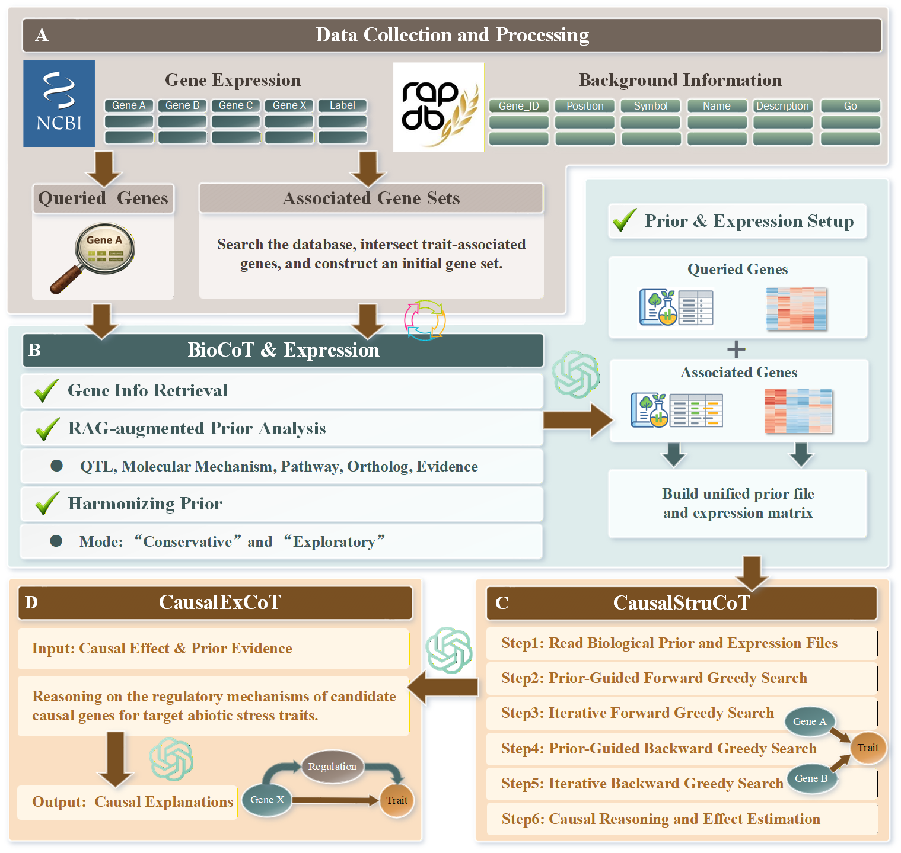

# Rice-CausalCoT
##Welcome to the code and materials repository of Rice-CausalCoT.



## Note
- The code in this repository is primarily intended to illustrate implementation concepts and interface usage, serving as a reference for learning and research.
## Installation
This project depends on a few third-party Python packages (e.g., playwright, pandas, openai). Everything else in the imports (such as os, re, json, csv, pathlib, typing, etc.) is part of the Python standard library and does not require installation.
##Requirements
•	Python 3.9+ (recommended: 3.10 / 3.11)  
•	pip  
##Setup (recommended: virtual environment)  
macOS / Linux:  
1.	Create a virtual environment:  
python -m venv .venv  
2.	Activate it:  
source .venv/bin/activate  
Windows PowerShell:  
1.	Create a virtual environment:  
python -m venv .venv  
2.	Activate it:  
.venv\Scripts\Activate.ps1  
##Install Python dependencies  
Run:  
pip install -U pandas openai playwright  
Optional: If you want to pin dependencies in requirements.txt, add:  
•	pandas  
•	openai  
•	playwright  
##Install Playwright browsers  
Because this project uses playwright.async_api, you also need to install the browser engines:  
playwright install  
On Linux, if system dependencies are missing:  
playwright install-deps  
##Configure OpenAI API key (if applicable)  
If the project calls the OpenAI API, set the OPENAI_API_KEY environment variable.  
Windows PowerShell:  
setx OPENAI_API_KEY "YOUR_API_KEY"  

## File Structure
1.	RAG/: Retrieval-Augmented Generation component.
    Gene_Intersection: Intersection of genes in functional databases and genes in the dataset.  
    Retrieve_information: Retrieves associated genes from functional databases.  
2. `BioCoT/`
**Description**  
This module implements the a priori reasoning Chain-of-Thought (CoT) component.

- `GPT_BioCoT.py`: Generates multidimensional reasoning evidence based on RAG embeddings and stores the results in `outputs/`.
- `Merge_BioCoT_Result.py`: Merges the reasoning results of all genes into a unified output file, `Bio_Result.csv`.

**Run**
```bash
cd BioCoT
python GPT_BioCoT.py
python Merge_BioCoT_Result.py.  
3.	CausalStruCoT/: Causal Structure Learning CoT component.
    Expression_Screening.py: Using gene IDs, filter out the corresponding gene columns from the full gene expression dataset.  
    Expression_Integration.py: Expression setup.    
    CausalCOT_AS.py: Executes the causal structure learning component under biological prior constraints.  


